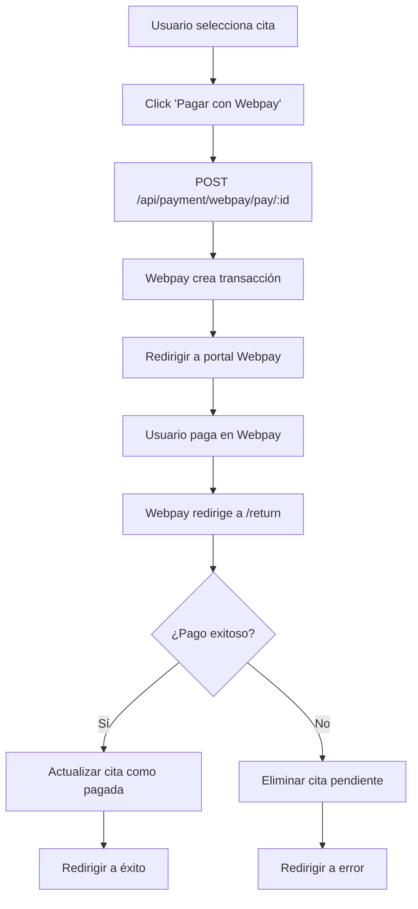

# VetGestion Backend - Configuración Webpay

## 🇨🇱 Integración Webpay (Transbank - Chile)

Este backend está configurado para procesar pagos con **Webpay**, el sistema de pagos más utilizado en Chile desarrollado por Transbank.

### ⚡ Inicio Rápido (3 minutos)

#### Opción A: Configuración Automática (Recomendado)

```bash
cd backend
npm run setup:webpay
```

#### Opción B: Configuración Manual

```bash
# 1. Instalar ngrok
npm install -g ngrok

# 2. Exponer puerto 5555
ngrok http 5555

# 3. Actualizar .env con la URL de ngrok
BASE_URL=https://abc123.ngrok.io

# 4. Iniciar servidor
npm run dev
```

### 🧪 Probar Webpay

1. Ve a tu frontend: `http://localhost:5173`
2. Selecciona una cita
3. Click **"Continuar al pago"**
4. **Tarjeta de prueba:** `4051885600446623` (Visa)
5. **Código:** `123`
6. **Fecha:** Cualquier fecha futura

### 📋 Prerrequisitos

1. **Cuenta en Transbank**: Registrarse en [Transbank Developers](https://www.transbankdevelopers.cl/)
2. **Credenciales de Webpay**: Obtener `Commerce Code` y `API Key`
3. **Node.js**: Versión 16 o superior
4. **MongoDB**: Base de datos configurada
5. **ngrok**: Para desarrollo local

### ⚙️ Configuración

#### 1. Variables de Entorno

Copia `.env.example` a `.env` y configura:

```bash
# Webpay Configuration
WEBPAY_COMMERCE_CODE=tu_codigo_comercio_aqui
WEBPAY_API_KEY=tu_api_key_aqui

# URLs de tu aplicación
BASE_URL=http://localhost:5555
FRONTEND_URL=http://localhost:5173

# Base de datos
mongoDBURL=mongodb://127.0.0.1:27017/VetGestion

# JWT Secret
JWT_SECRET=tu_clave_secreta_muy_segura_aqui
```

#### 2. Credenciales de Producción vs Integración

- **Integración**: Para pruebas y desarrollo
- **Producción**: Para ambiente real

```javascript
// En webpayController.js
environment: process.env.NODE_ENV === "production"
  ? "PRODUCTION"
  : "INTEGRATION";
```

### 🚀 Endpoints de Webpay

#### Iniciar Pago

```
GET /api/payment/webpay/pay/:appointmentId
```

- Crea transacción en Webpay
- Redirige usuario al portal de pagos

#### Retorno desde Webpay

```
GET /api/payment/webpay/return
```

- Webpay redirige aquí después del pago
- Confirma transacción y actualiza BD

#### Verificar Estado

```
GET /api/payment/webpay/status/:token
```

- Consulta estado de una transacción

#### Refund (Opcional)

```
POST /api/payment/webpay/refund
```

- Reembolsa un pago procesado

### 💳 Flujo de Pago



### 🛠️ Desarrollo y Testing

#### Ambiente de Integración

- **URL**: `https://webpay3gint.transbank.cl`
- **Credenciales**: Automáticas para testing
- **Tarjetas de prueba**:
  - Visa: `4051885600446623`
  - Mastercard: `5186059559590568`
  - Código de seguridad: `123`
  - Fecha: Cualquier fecha futura

#### Logs de Debug

```javascript
console.log("💳 Webpay Payment Details:");
console.log("  - Amount:", amount);
console.log("  - Buy Order:", buyOrder);
console.log("  - Token:", token);
```

### 🌐 **¿Se puede usar Webpay en Localhost?**

**¡SÍ!** Webpay tiene un **ambiente de integración** especialmente diseñado para desarrollo local.

#### Configuración para Localhost:

1. **Usa las credenciales de integración** (ya configuradas):

```bash
WEBPAY_COMMERCE_CODE=597055555532
WEBPAY_API_KEY=579B532A7440BB0C9079DED94D31EA1615BACEB56610332264630D42D0A36B1C
NODE_ENV=development
```

2. **Tu aplicación debe estar accesible desde internet** para que Webpay pueda redirigir de vuelta.

#### Opciones para Localhost:

##### Opción A: Ngrok (Recomendado)

```bash
# Instalar ngrok
npm install -g ngrok

# Exponer puerto 5555
ngrok http 5555

# Actualizar BASE_URL con la URL de ngrok
BASE_URL=https://abc123.ngrok.io
```

##### Opción B: Localtunnel

```bash
# Instalar localtunnel
npm install -g localtunnel

# Exponer puerto 5555
lt --port 5555

# Actualizar BASE_URL con la URL generada
```

##### Opción C: Servidor de desarrollo con HTTPS

Configurar un servidor local con HTTPS usando herramientas como:

- **mkcert** para certificados locales
- **serve** con SSL
- **webpack-dev-server** con HTTPS

#### URLs de Retorno:

```javascript
// Para desarrollo con ngrok
const returnUrl = `${process.env.BASE_URL}/api/payment/webpay/return`;
const finalUrl = `${process.env.BASE_URL}/api/payment/webpay/final`;

// Ejemplo:
// returnUrl = https://abc123.ngrok.io/api/payment/webpay/return
// finalUrl = https://abc123.ngrok.io/api/payment/webpay/final
```

### 🧪 **Cómo Probar Webpay en Localhost:**

#### Paso 1: Instalar ngrok

```bash
npm install -g ngrok
```

#### Paso 2: Exponer tu aplicación

```bash
ngrok http 5555
```

Esto te dará una URL como: `https://abc123.ngrok.io`

#### Paso 3: Actualizar variables de entorno

```bash
BASE_URL=https://abc123.ngrok.io
FRONTEND_URL=http://localhost:5173
```

#### Paso 4: Reiniciar el servidor

```bash
npm run dev
```

#### Paso 5: Probar el pago

1. Ve a tu aplicación frontend
2. Selecciona una cita
3. Haz click en "Continuar al pago"
4. Serás redirigido al portal de Webpay
5. Usa las tarjetas de prueba:
   - **Visa**: `4051885600446623`
   - **Código**: `123`
   - **Fecha**: Cualquier fecha futura

#### Paso 6: Verificar el flujo

- Webpay procesará el pago
- Te redirigirá de vuelta a tu aplicación
- La cita se marcará como pagada

### ⚠️ **Importante:**

- **No uses credenciales de producción** en localhost
- **Las transacciones en integración no son reales**
- **Los montos en integración son simulados**
- **Para producción necesitarás credenciales reales de Transbank**

---

**Nota**: Esta integración está configurada para **ambiente de integración**. Para producción, cambia `NODE_ENV=production` y usa credenciales reales de Transbank.
